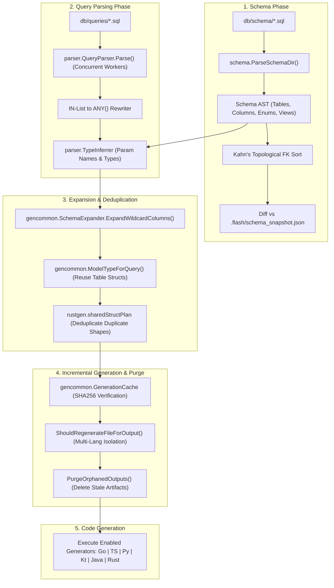

# AGENT.md — FlashORM Contributor & AI Agent Engineering Guide

> **Target Audience:** AI Coding Assistants (Antigravity, Qwen, Claude, Copilot, Cursor) and Human Maintainers.
> **Repository:** `github.com/Lumos-Labs-HQ/flash` (`FlashORM`)
> **Language Standard:** Go 1.27 (`-tags="dev,plugins"`)
> **Single Source of Truth:** Read this file completely before creating, modifying, or refactoring code in this repository.

---

## 1. System Overview & Philosophy

**FlashORM** is a high-performance, SQL-first type-safe ORM and code generator. Developers write raw SQL schema (DDL) and annotated SQL queries; FlashORM compiles them at build time into zero-reflection, strongly-typed client code for **Go, TypeScript/JavaScript, Python, Kotlin, Java, and Rust**.

### Core Tenets
1. **Zero Runtime Reflection:** Generated code uses explicit typed getters/setters, native struct scans, and pre-compiled statements.
2. **Single-Pass Compilation:** Queries, parameters, and return types are inferred in a single traversal through an ordered cascade inferrer.
3. **Incremental & Resilient Caching:** Output files are only regenerated if their source SHA256 checksums change. Stale/orphaned files are purged automatically, and multi-language outputs are strictly isolated.
4. **Deterministic SQL Rewriting:** High-level patterns (e.g. `IN ($1, $2, ...)` → `= ANY($1)`) are converted deterministically without altering semantics.
5. **Multi-Database Agnostic:** Native support for PostgreSQL, MySQL, SQLite, ClickHouse, ScyllaDB (CQL), and MongoDB.

---

## 2. Repository Layout & Package Map

```
flash/
├── cmd/                        # CLI Commands (Cobra framework)
│   ├── root.go / root_dev.go  # Entrypoints (Production vs Dev with embedded plugins)
│   ├── base.go / base_dev.go  # Command registry bindings
│   ├── gen.go                 # 'flash gen' code generation driver
│   ├── migrate.go / apply.go  # 'flash migrate', 'flash apply', 'flash down', 'flash status'
│   ├── init.go                # 'flash init' project scaffolder
│   ├── seed.go                # 'flash seed' mock data generator
│   ├── studio.go              # 'flash studio' local web UI runner
│   ├── pull.go / export.go    # Introspect live databases & export data
│   ├── branch.go              # DB schema branching
│   ├── issues.go              # Automated diagnostic and bug reporting
│   └── plugins.go             # Plugin binary manager (add/remove/list)
├── internal/
│   ├── config/                # 'flash.toml' parser, validator & multi-db [[databases]] resolver
│   ├── schema/                # DDL SQL parser, Kahn's topological FK sort, schema diff & snapshots
│   ├── parser/                # Query parser, worker-pool concurrency, TypeInferrer, CTE & JSON resolver
│   ├── gencommon/             # Shared generator core: GenerationCache, wildcard expansion, naming, pools
│   ├── gogen/                 # Go client generator (db.go, models.go, queries.go, cache wrappers)
│   ├── jsgen/                 # TypeScript / JavaScript client generator (index.d.ts, index.js, queries.js)
│   ├── pygen/                 # Python client generator (sync/async, TypedDict, .pyi stubs)
│   ├── kotlingen/             # Kotlin client generator (Models.kt, Queries.kt, JDBC typed accessors)
│   ├── javagen/               # Java client generator (one public class per .java file)
│   ├── rustgen/               # Rust client generator (sqlx, sharedStructPlan dedup, type aliases)
│   ├── database/              # Uniform Adapter interface & drivers (pgx, mysql, sqlite3, gocql, clickhouse)
│   ├── migrator/              # Reversible migration engine (UP/DOWN diffs, _flash_migrations table)
│   ├── studio/                # Embedded web servers for SQL, MongoDB, and Redis management
│   ├── seeder/                # Faker mock data generator & DAG topological table insertion
│   ├── pull/                  # Reverse-engineering engine from live DB metadata to DDL
│   ├── export/                # Database table dump engine (JSON, CSV, SQLite)
│   ├── backup/                # Table-level safety snapshots before destructive operations
│   ├── branch/                # Database-level isolated schema branching
│   ├── plugin/                # IPC plugin system (stdin/stdout JSON-RPC)
│   ├── validation/            # Pre-flight query validation against schema AST
│   ├── utils/                 # Safe SQL identifier quoting, string casing, raw execution
│   └── types/                 # Shared data structures across packages
├── template/                  # Scaffolding templates and FLASH.md agent guide generator
├── test/
│   ├── integration/           # Multi-DB integration tests & Docker compose harnesses
│   └── langs/                 # Multi-language codegen & wiring matrix tests
├── gotest.sh                  # Custom test runner with structured summary output
├── Taskfile.yml               # Canonical task runner definitions
└── main.go                    # Binary entrypoint
```

---

## 3. End-to-End Compilation Pipeline



---

## 4. Critical Invariants & Rules for AI Agents

When modifying or adding code in this repository, you **MUST** uphold these rules:

### A. Performance & Memory Allocation
1. **Pre-allocate String Builders:** Always estimate size and call `builder.Grow(n)` before writing query strings or generated files.
2. **Compiled Regex Cache:** Never call `regexp.MustCompile()` in hot paths or loops. Always use `internal/parser/regex_cache.go:GetCachedPattern(pattern)`.
3. **Concurrent Query Parsing:** Use worker pools bounded by `runtime.NumCPU()` and protect shared structures with `sync.RWMutex`.

### B. Cache Integrity & Multi-Generator Isolation
1. **Cross-Generator Cache Safety:** Multiple language generators may share an output directory. Never assume that if `.flash_cache.json` exists, every language's files exist.
   - Use `gencommon.ShouldRegenerateFileForOutput(cache, outDir, targetFile, queryHash)`.
   - Probe canonical model existence across each language generator independently.
2. **Orphan Output Purging:** When a `.sql` query file is deleted from `db/queries/`, the generator must purge the corresponding generated code file from disk.

### C. Type Inference & Parameter Resolution
1. **Cascade Priority:** `TypeInferrer` resolves parameter names and types in a strict hierarchy:
   - Positional INSERT columns: `INSERT INTO tbl (c1, c2) VALUES (?, ?)`
   - `ANY($N)` clauses: `col = ANY($1)` → slice/array type
   - Clause lookups: `WHERE col = $N`, `JOIN ... ON ...`, `SET col = COALESCE($N, col)`
   - Wrapped expressions: `lower(col) = lower(?)`, `CAST(col AS BIGINT) = ?`
   - TVF & JSON expressions: `json_each.value`, `col @> $N`, `col ->> $N`
   - Fallback: `paramN` / `TEXT`
2. **Positional `?` vs Dollar `$N` Handling:** PostgreSQL uses `$1, $2`; MySQL, SQLite, ClickHouse use `?`. When rewriting queries, maintain exact parameter index offsets.

### D. Multi-Wildcard Disambiguation
- When expanding `SELECT f.*, u.* FROM followers f JOIN users u ON ...`, detect identical column names (e.g., `id`, `created_at`) and prefix them with alias identifiers (`f_id`, `u_id`) to avoid collision in generated structs.

### E. Rust Struct Deduplication
- For `rustgen`, duplicate row shapes across queries must be deduplicated via `sharedStructPlan`, generating canonical structs with `pub type QueryRow = CanonicalRow;` aliases rather than duplicating identical struct definitions.

### F. Go 1.27 Modern Idioms
- Always write idiomatic Go 1.27:
  - `slices.Contains`, `slices.Sort`, `slices.Backward`
  - `strings.Cut`, `strings.CutPrefix`, `strings.CutLast`
  - `sync.OnceFunc` for lazy initialization
  - `wg.Go(...)` for structured goroutine concurrency
  - `t.Context()` in tests

---

## 5. Testing Standards & Conventions

### Running Tests
All commands use the `dev,plugins` build tags:

```bash
# 1. Fast smoke test (all unit tests with formatted summary)
task smoke
# or: ./gotest.sh

# 2. Complete test suite (builds binary + runs all tests)
task test

# 3. Race condition detection
task race

# 4. Integration tests (requires Docker / live DBs)
task test-integration

# 5. Linting & formatting
task lint
task fmt
```

### Writing Tests
1. **SQLite Self-Containment:** SQLite integration tests must create temporary in-memory or file-based DBs on the fly and run without requiring external `DATABASE_URL` environment variables.
2. **External DB Graceful Skipping:** For PostgreSQL, MySQL, ClickHouse, and ScyllaDB, tests must probe connectivity with a short timeout. If the database is unreachable, skip gracefully using `t.Skipf("database not reachable: %v", err)` instead of failing or blocking.
3. **Regression Tests:** Every bug fix or edge-case handling must be accompanied by a dedicated test in the corresponding package:
   - Parser edge cases: `internal/parser/param_edge_test.go` or `adversarial_test.go`
   - Migrator edge cases: `internal/migrator/edge_cases_test.go`
   - Cache edge cases: `internal/gencommon/cache_edge_cases_test.go`
   - Multi-language codegen: `test/langs/langs_gen_test.go`

---

## 6. Checklist for Changes

Before submitting any Pull Request or completing an AI task:
- [ ] Code builds cleanly with `task build`.
- [ ] `task smoke` passes with **0 failures and 0 skipped packages**.
- [ ] No regression in incremental caching or cross-generator output isolation.
- [ ] All new SQL grammar or inference additions have unit test coverage in `internal/parser/`.
- [ ] String builders pre-allocate memory and regexes use `regex_cache`.
- [ ] Commit message follows conventional format: `feat(scope): ...`, `fix(scope): ...`, `test(scope): ...`.
